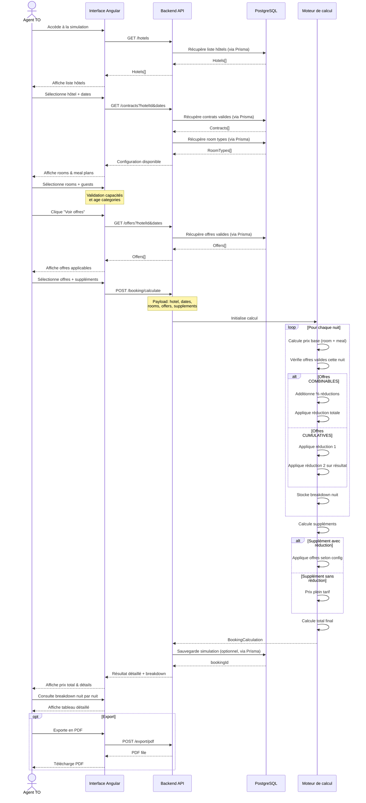

```mermaid
sequenceDiagram
    actor Agent as Agent TO
    participant UI as Interface Angular
    participant API as Backend API
    participant DB as PostgreSQL
    participant Calc as Moteur de calcul

    Agent->>UI: Accède à la simulation
    UI->>API: GET /hotels
    API->>DB: Récupère liste hôtels (via Prisma)
    DB-->>API: Hotels[]
    API-->>UI: Hotels[]
    UI-->>Agent: Affiche liste hôtels

    Agent->>UI: Sélectionne hôtel + dates
    UI->>API: GET /contracts?hotelId&dates
    API->>DB: Récupère contrats valides (via Prisma)
    DB-->>API: Contracts[]
    API->>DB: Récupère room types (via Prisma)
    DB-->>API: RoomTypes[]
    API-->>UI: Configuration disponible
    UI-->>Agent: Affiche rooms & meal plans

    Agent->>UI: Sélectionne rooms + guests
    Note over UI: Validation capacités<br/>et age categories
    
    Agent->>UI: Clique "Voir offres"
    UI->>API: GET /offers?hotelId&dates
    API->>DB: Récupère offres valides (via Prisma)
    DB-->>API: Offers[]
    API-->>UI: Offers[]
    UI-->>Agent: Affiche offres applicables

    Agent->>UI: Sélectionne offres + suppléments
    UI->>API: POST /booking/calculate
    Note over API: Payload: hotel, dates,<br/>rooms, offers, supplements
    
    API->>Calc: Initialise calcul
    
    loop Pour chaque nuit
        Calc->>Calc: Calcule prix base (room + meal)
        Calc->>Calc: Vérifie offres valides cette nuit
        
        alt Offres COMBINABLES
            Calc->>Calc: Additionne % réductions
            Calc->>Calc: Applique réduction totale
        else Offres CUMULATIVES
            Calc->>Calc: Applique réduction 1
            Calc->>Calc: Applique réduction 2 sur résultat
        end
        
        Calc->>Calc: Stocke breakdown nuit
    end
    
    Calc->>Calc: Calcule suppléments
    alt Supplément avec réduction
        Calc->>Calc: Applique offres selon config
    else Supplément sans réduction
        Calc->>Calc: Prix plein tarif
    end
    
    Calc->>Calc: Calcule total final
    Calc-->>API: BookingCalculation
    
    API->>DB: Sauvegarde simulation (optionnel, via Prisma)
    DB-->>API: bookingId
    
    API-->>UI: Résultat détaillé + breakdown
    UI-->>Agent: Affiche prix total & détails
    
    Agent->>UI: Consulte breakdown nuit par nuit
    UI-->>Agent: Affiche tableau détaillé
    
    opt Export
        Agent->>UI: Exporte en PDF
        UI->>API: POST /export/pdf
        API-->>UI: PDF file
        UI-->>Agent: Télécharge PDF
    end
```