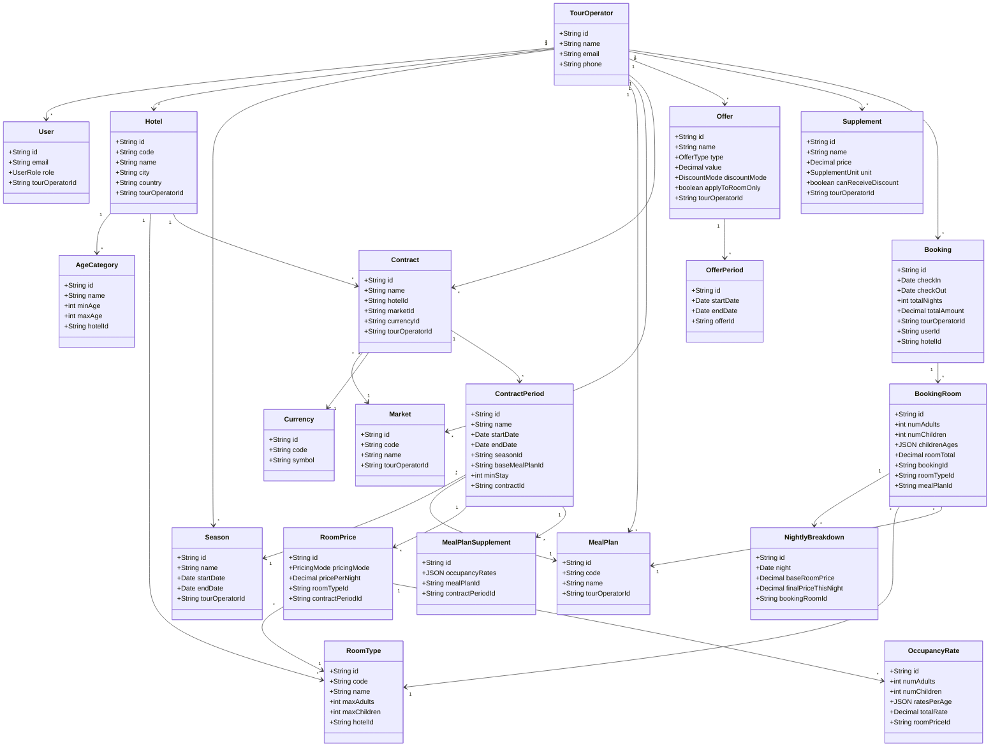

# Diagramme de Classe



---

## 🔑 Points clés de la structure

### 1️⃣ Multi-tenancy
**Tous les modèles principaux ont `tourOperatorId`** pour isoler les données entre TO différents.

### 2️⃣ Hiérarchie Hotel
```
Hotel
├─ AgeCategory (Infant 0-2, Child 3-11, Adult 12+)
└─ RoomType (Standard, Suite, etc.)
```

### 3️⃣ Season → ContractPeriod
```
Season "Winter High" (20/12 → 05/01)
  ↓
ContractPeriod utilise cette season
  - startDate: 20/12 (copié depuis Season)
  - endDate: 05/01 (copié depuis Season)
  - seasonId: lien vers Season
```

**Avantage** : Si tu modifies la Season, tu peux retrouver tous les ContractPeriod liés.

### 4️⃣ Tarification flexible

**Mode PER_ROOM** :
```
RoomPrice {
  pricingMode: "PER_ROOM"
  pricePerNight: 100€
  occupancyRates: [] (vide)
}
```

**Mode PER_OCCUPANCY** :
```
RoomPrice {
  pricingMode: "PER_OCCUPANCY"
  pricePerNight: null
  occupancyRates: [
    OccupancyRate {
      numAdults: 1, numChildren: 0
      totalRate: 120€
    },
    OccupancyRate {
      numAdults: 2, numChildren: 0
      totalRate: 180€
    }
  ]
}
```

### 5️⃣ Booking → BookingRoom → NightlyBreakdown

**Structure hiérarchique claire** :
```
Booking (Facture globale)
  ├─ totalAmount: 1500€
  ├─ checkIn/checkOut
  │
  ├─ BookingRoom 1 (Chambre Standard)
  │  ├─ numAdults: 2, numChildren: 1
  │  ├─ roomTotal: 850€
  │  │
  │  └─ NightlyBreakdown (détail par nuit)
  │     ├─ Nuit 20/12: 180€
  │     ├─ Nuit 21/12: 180€
  │     └─ Nuit 22/12: 198€
  │
  └─ BookingRoom 2 (Chambre Suite)
     └─ ...
```

---

## 📋 Exemple de données réelles

### Season
```json
{
  "id": "season-winter-high",
  "name": "Winter High Season",
  "startDate": "2024-12-20",
  "endDate": "2025-01-05",
  "tourOperatorId": "to-horizon"
}
```

### Contract avec Period
```json
{
  "id": "contract-paris-winter",
  "name": "Hotel Paris - Winter 2025",
  "hotelId": "hotel-paris",
  "marketId": "market-france",
  "tourOperatorId": "to-horizon",
  
  "periods": [
    {
      "id": "period-1",
      "name": "Winter High",
      "startDate": "2024-12-20",
      "endDate": "2025-01-05",
      "seasonId": "season-winter-high",
      "baseMealPlanId": "meal-bb",
      
      "roomPrices": [
        {
          "pricingMode": "PER_ROOM",
          "pricePerNight": 200,
          "roomTypeId": "room-standard"
        }
      ]
    }
  ]
}
```

### Booking complet
```json
{
  "id": "booking-123",
  "checkIn": "2024-12-20",
  "checkOut": "2024-12-27",
  "totalNights": 7,
  "totalAmount": 1500,
  "tourOperatorId": "to-horizon",
  
  "rooms": [
    {
      "id": "br-1",
      "roomTypeId": "room-standard",
      "numAdults": 2,
      "numChildren": 1,
      "childrenAges": [5],
      "roomTotal": 850,
      
      "nightlyBreakdown": [
        {
          "night": "2024-12-20",
          "baseRoomPrice": 200,
          "finalPriceThisNight": 180
        },
        {
          "night": "2024-12-21",
          "baseRoomPrice": 200,
          "finalPriceThisNight": 180
        }
      ]
    }
  ]
}
```

---

## ✅ Modifications appliquées

| Changement | Raison |
|------------|--------|
| ✅ Retiré `isHighSeason` de Season | Cosmétique uniquement, pas de logique business |
| ✅ Retiré `validFrom`/`validTo` de Contract | On utilise Season à la place |
| ✅ Retiré `SpecialRule` | Trop complexe pour MVP, on garde pour V2 |
| ✅ `seasonId` obligatoire dans ContractPeriod | Toutes les périodes doivent référencer une season |
| ✅ Gardé `tourOperatorId` partout | Multi-tenancy essentiel |
| ✅ Gardé PER_OCCUPANCY + OccupancyRate | Tarification complexe |
| ✅ Gardé NightlyBreakdown | Transparence totale du calcul |

---