# Diagramme de Classe - Tour Operator System (Version Finale)

```mermaid
classDiagram
    class TourOperator {
        +String id
        +String name
        +String email
        +String phone
        +Date createdAt
    }

    class User {
        +String id
        +String tourOperatorId
        +String email
        +String firstName
        +String lastName
        +UserRole role
        +Date createdAt
    }

    class Hotel {
        +String id
        +String tourOperatorId
        +String name
        +String code
        +String destination
        +String address
        +String contact
        +Date createdAt
        +Date updatedAt
    }

    class AgeCategory {
        +String id
        +String name
        +int minAge
        +int maxAge
    }

    class RoomType {
        +String id
        +String name
        +String code
        +int maxAdults
        +int maxChildren
        +String description
    }

    class MealPlan {
        +String id
        +String tourOperatorId
        +String code
        +String name
        +String description
    }

    class Season {
        +String id
        +String tourOperatorId
        +String name
        +Date startDate
        +Date endDate
        +boolean isHighSeason
        +Date createdAt
        +Date updatedAt
    }

    class Market {
        +String id
        +String tourOperatorId
        +String name
        +String code
    }

    class Currency {
        +String id
        +String code
        +String symbol
        +String name
    }

    class Contract {
        +String id
        +String tourOperatorId
        +String hotelId
        +String marketId
        +String currencyId
        +String name
        +Date validFrom
        +Date validTo
        +Date createdAt
        +Date updatedAt
    }

    class ContractPeriod {
        +String id
        +String name
        +Date startDate
        +Date endDate
        +String baseMealPlanId
        +String seasonId
        +int minStay
    }

    class RoomPrice {
        +String id
        +String roomTypeId
        +PricingMode pricingMode
        +Decimal pricePerNight
        +Decimal flatRateTotal
    }

    class OccupancyRate {
        +String id
        +int numAdults
        +int numChildren
        +JSON ratesPerAge
        +Decimal totalRate
    }

    class MealPlanSupplement {
        +String id
        +String mealPlanId
        +JSON occupancyRates
    }

    class StopSalesDate {
        +String id
        +Date date
        +String reason
    }

    class SpecialRule {
        +String id
        +String name
        +String description
        +String ruleType
        +JSON conditions
    }

    class Offer {
        +String id
        +String tourOperatorId
        +String name
        +String description
        +OfferType type
        +Decimal value
        +DiscountMode discountMode
        +boolean applyToRoomOnly
        +boolean applyToMealSupplements
        +int minStay
        +Date createdAt
        +Date updatedAt
    }

    class OfferPeriod {
        +String id
        +Date startDate
        +Date endDate
    }

    class OfferSupplement {
        +String supplementId
        +boolean applyDiscount
    }

    class Supplement {
        +String id
        +String tourOperatorId
        +String name
        +String description
        +Decimal price
        +SupplementUnit unit
        +boolean canReceiveDiscount
        +Date createdAt
        +Date updatedAt
    }

    class Booking {
        +String id
        +String tourOperatorId
        +String userId
        +String hotelId
        +String marketId
        +String currencyId
        +Date checkIn
        +Date checkOut
        +int totalNights
        +Decimal roomsSubtotal
        +Decimal mealSupplementsTotal
        +Decimal discountAmount
        +Decimal supplementsTotal
        +Decimal totalAmount
        +BookingStatus status
        +Date createdAt
        +Date updatedAt
    }

    class BookingRoom {
        +String id
        +String roomTypeId
        +String mealPlanId
        +int numAdults
        +int numChildren
        +JSON childrenAges
        +Decimal roomSubtotal
        +Decimal mealSupplementsSubtotal
        +Decimal roomDiscountAmount
        +Decimal roomTotal
    }

    class NightlyBreakdown {
        +String id
        +Date night
        +Decimal baseRoomPrice
        +String baseMealPlanIncluded
        +Decimal mealSupplementPrice
        +JSON appliedOffers
        +Decimal totalDiscountAmount
        +Decimal finalPriceThisNight
    }

    class BookingAppliedOffer {
        +String offerId
        +String offerName
        +Decimal totalDiscountAmount
        +int nightsApplied
    }

    class BookingSupplement {
        +String id
        +String supplementId
        +String name
        +int quantity
        +Decimal unitPrice
        +Decimal discountAmount
        +Decimal total
    }

    %% Enums
    class UserRole {
        <<enumeration>>
        ADMIN
        MANAGER
        AGENT
    }

    class PricingMode {
        <<enumeration>>
        PER_ROOM
        PER_OCCUPANCY
        FLAT_RATE
    }

    class OfferType {
        <<enumeration>>
        PERCENTAGE
        FLAT_AMOUNT
    }

    class DiscountMode {
        <<enumeration>>
        SEQUENTIAL
        ADDITIVE
    }

    class SupplementUnit {
        <<enumeration>>
        PER_PERSON_PER_NIGHT
        PER_PERSON_PER_STAY
        PER_ROOM_PER_NIGHT
        PER_ROOM_PER_STAY
    }

    class BookingStatus {
        <<enumeration>>
        SIMULATION
        CONFIRMED
        CANCELLED
    }

    %% Relations Core
    TourOperator "1" -- "*" User
    TourOperator "1" -- "*" Hotel
    TourOperator "1" -- "*" MealPlan
    TourOperator "1" -- "*" Season
    TourOperator "1" -- "*" Market
    TourOperator "1" -- "*" Contract
    TourOperator "1" -- "*" Offer
    TourOperator "1" -- "*" Supplement
    TourOperator "1" -- "*" Booking

    %% Relations Hotel
    Hotel "1" -- "*" AgeCategory
    Hotel "1" -- "*" RoomType
    Hotel "1" -- "*" Contract

    %% Relations Contract
    Contract "1" -- "*" ContractPeriod
    Contract "1" -- "*" SpecialRule
    Contract "*" -- "1" Market
    Contract "*" -- "1" Currency

    %% Relations ContractPeriod
    ContractPeriod "1" -- "*" RoomPrice
    ContractPeriod "1" -- "*" MealPlanSupplement
    ContractPeriod "1" -- "*" StopSalesDate
    ContractPeriod "*" -- "1" MealPlan : baseMealPlan
    ContractPeriod "*" -- "0..1" Season : linkedTo

    %% Relations RoomPrice (NOUVEAU)
    RoomPrice "*" -- "1" RoomType
    RoomPrice "1" -- "*" OccupancyRate : hasRates

    %% Relations MealPlanSupplement
    MealPlanSupplement "*" -- "1" MealPlan

    %% Relations Offer
    Offer "1" -- "*" OfferPeriod
    Offer "1" -- "*" OfferSupplement

    OfferSupplement "*" -- "1" Supplement

    %% Relations Booking
    Booking "1" -- "*" BookingRoom
    Booking "1" -- "*" BookingAppliedOffer
    Booking "1" -- "*" BookingSupplement
    Booking "*" -- "1" Hotel
    Booking "*" -- "1" Market
    Booking "*" -- "1" Currency
    Booking "*" -- "1" User

    %% Relations BookingRoom
    BookingRoom "1" -- "*" NightlyBreakdown
    BookingRoom "*" -- "1" RoomType
    BookingRoom "*" -- "1" MealPlan

    %% Relations BookingAppliedOffer
    BookingAppliedOffer "*" -- "1" Offer

    %% Relations BookingSupplement
    BookingSupplement "*" -- "1" Supplement
```



---

## 📋 Changements vs Version Précédente

### ✅ Ajouts

1. **Season** (Nouvelle entité)

   - Entité réutilisable pour définir des saisons
   - Relation `0..1` avec `ContractPeriod` (optionnel)
   - Attribut `isHighSeason` pour analytics

2. **OccupancyRate** (Nouvelle table)
   - Stocke les tarifs par configuration d'occupants
   - Relation `1..*` avec `RoomPrice`
   - Champs : `numAdults`, `numChildren`, `ratesPerAge` (JSON), `totalRate`

### ⚠️ Modifications

1. **PricingMode** (Enum modifié)

   - ❌ Suppression de `HYBRID`
   - ✅ Ajout de `PER_OCCUPANCY`
   - Conservation de `PER_ROOM` et `FLAT_RATE`

2. **DiscountMode** (Enum renommé)

   - `CUMULATIVE` → **`SEQUENTIAL`**
   - `COMBINABLE` → **`ADDITIVE`**

3. **SupplementUnit** (Enum étendu)

   - ✅ `PER_PERSON_PER_NIGHT` (nouveau)
   - ✅ `PER_PERSON_PER_STAY` (nouveau)
   - ✅ `PER_ROOM_PER_NIGHT` (nouveau)
   - ✅ `PER_ROOM_PER_STAY` (nouveau)

4. **RoomPrice** (Structure modifiée)

   - Ajout de relation `1..*` vers `OccupancyRate`
   - `pricePerNight` devient optionnel (NULL si `PER_OCCUPANCY`)

5. **MealPlanSupplement** (Structure modifiée)
   - Champ `occupancyRates` devient JSON
   - Structure : `{ "1-0": 15, "2-0": 30, "2-1": 40 }`

---

## 🔑 Légende des Relations

| Cardinalité   | Signification        | Exemple                             |
| ------------- | -------------------- | ----------------------------------- |
| `1` -- `*`    | One-to-Many          | 1 Hotel → plusieurs RoomTypes       |
| `*` -- `1`    | Many-to-One          | Plusieurs Contracts → 1 Market      |
| `1` -- `1`    | One-to-One           | (Aucun dans ce schéma)              |
| `*` -- `0..1` | Many-to-Optional-One | ContractPeriod → Season (optionnel) |

---

## 📊 Exemples de Données

### Exemple 1 : RoomPrice PER_ROOM

```
RoomPrice {
  id: "rp-1"
  pricingMode: PER_ROOM
  pricePerNight: 100.00
  roomTypeId: "room-standard"
  occupancyRates: [] (vide)
}
```

### Exemple 2 : RoomPrice PER_OCCUPANCY

```
RoomPrice {
  id: "rp-2"
  pricingMode: PER_OCCUPANCY
  pricePerNight: null
  roomTypeId: "room-suite"
  occupancyRates: [
    OccupancyRate {
      numAdults: 1,
      numChildren: 0,
      ratesPerAge: {
        "adult_cat_id": { rate: 120, order: 1 }
      },
      totalRate: 120
    },
    OccupancyRate {
      numAdults: 2,
      numChildren: 0,
      ratesPerAge: {
        "adult_cat_id": { rate: 90, order: 1 },
        "adult_cat_id": { rate: 90, order: 2 }
      },
      totalRate: 180
    }
  ]
}
```

### Exemple 3 : MealPlanSupplement

```
MealPlanSupplement {
  id: "mps-1"
  mealPlanId: "meal-hb"
  contractPeriodId: "period-1"
  occupancyRates: {
    "1-0": 15,   // Single : +15€/nuit
    "2-0": 30,   // Double : +30€/nuit
    "2-1": 40,   // Double + 1 enfant : +40€/nuit
    "2-2": 50    // Double + 2 enfants : +50€/nuit
  }
}
```

### Exemple 4 : Season

```
Season {
  id: "season-1"
  tourOperatorId: "to-1"
  name: "Winter High Season"
  startDate: 2024-12-20
  endDate: 2025-01-05
  isHighSeason: true
}

ContractPeriod {
  id: "period-1"
  contractId: "contract-1"
  seasonId: "season-1"  ← Lié à la season
  name: "Winter High Season"
  startDate: 2024-12-20  ← Même dates que la season
  endDate: 2025-01-05
  baseMealPlanId: "meal-bb"
  minStay: 3
}
```

---

## 🎯 Points Clés du Modèle

### 1. Tarification Flexible

- **PER_ROOM** : Prix fixe par chambre
- **PER_OCCUPANCY** : Prix selon configuration (Single ≠ Double ≠ Triple)
- **FLAT_RATE** : Prix forfaitaire période

### 2. Offres Non Mixables

- **SEQUENTIAL** : Composition multiplicative → Prix × (1-A) × (1-B)
- **ADDITIVE** : Addition avant application → Prix × (1-(A+B))
- ⚠️ **Une offre SEQUENTIAL bloque les ADDITIVE** (et vice-versa)

### 3. Suppléments Explicites

- **PER_PERSON_PER_NIGHT** : Demi-pension, taxe de séjour
- **PER_PERSON_PER_STAY** : Excursion, visa, vol
- **PER_ROOM_PER_NIGHT** : Vue mer, upgrade
- **PER_ROOM_PER_STAY** : Pack romantique, nettoyage

### 4. Seasons Réutilisables

- Définies au niveau Tour Operator
- Réutilisables dans plusieurs contrats
- Pré-remplissent les dates des périodes

### 5. Breakdown Nuit par Nuit

- Chaque nuit est calculée individuellement
- Permet application partielle des offres
- Stockage complet dans `NightlyBreakdown`

---

## 🔄 Flux de Calcul Pricing

```
1. Agent sélectionne :
   - Hôtel, dates, market, currency
   - Chambres (room type + occupants)
   - Meal plans
   - Offres
   - Suppléments

2. Backend récupère (1 requête DB) :
   - Contract avec periods, roomPrices, occupancyRates
   - Offers avec offerPeriods

3. Pour CHAQUE nuit :
   a. Trouver ContractPeriod valide
   b. Calculer prix base :
      - Si PER_ROOM → pricePerNight
      - Si PER_OCCUPANCY → lookup OccupancyRate par (adults, children)
   c. Appliquer offres valides cette nuit :
      - Si SEQUENTIAL → composition
      - Si ADDITIVE → addition
   d. Stocker breakdown (night, basePrice, discount, finalPrice)

4. Calculer meal plan supplements :
   - Lookup occupancyRates JSON par clé "adults-children"
   - Multiplier par nombre de nuits

5. Calculer suppléments :
   - PER_NIGHT → prix × quantity × nights
   - PER_STAY → prix × quantity (pas × nights)
   - Appliquer réductions si canReceiveDiscount

6. Agréger :
   - roomsSubtotal = Σ breakdown.finalPrice
   - supplementsTotal = Σ supplements.total
   - totalAmount = roomsSubtotal + supplementsTotal
```

---

## ✅ Validation Modèle

| Aspect                  | Validé | Implémenté Dans                     |
| ----------------------- | ------ | ----------------------------------- |
| Season réutilisable     | ✅     | `Season` entity                     |
| PER_OCCUPANCY mode      | ✅     | `OccupancyRate` table               |
| SEQUENTIAL vs ADDITIVE  | ✅     | `DiscountMode` enum                 |
| 4 unités suppléments    | ✅     | `SupplementUnit` enum               |
| Breakdown nuit par nuit | ✅     | `NightlyBreakdown` table            |
| Meal sup = prix total   | ✅     | `MealPlanSupplement.occupancyRates` |

---

**Diagramme de classe mis à jour et validé** ✅
